# 马晓飞 · Ma Xiaofei

**Java 开发工程师** · 9 年经验 · 微服务 & 高并发 & 行业数字化

*专注智慧能源 / 加油行业全链路平台*

---

## 技术栈

  

| 类别 | 技术 |
|------|------|
| 框架 | Spring Boot、Spring Cloud、MyBatis |
| 治理 / 网关 | Nacos、Spring Cloud Gateway |
| 数据 | MySQL、Redis |
| 消息 | RocketMQ |
| 工程化 | Git、Maven、Linux |

---

### 常用语言（Top languages）

<!-- 由仓库内 Actions 生成 SVG，避免第三方 Vercel 实例不稳定导致图片裂开 -->

语言图由 <code>.github/workflows/update-readme-stats.yml</code> 定时更新；若未显示，请到仓库 <strong>Actions</strong> 手动运行一次 <strong>Update README top languages card</strong>。

